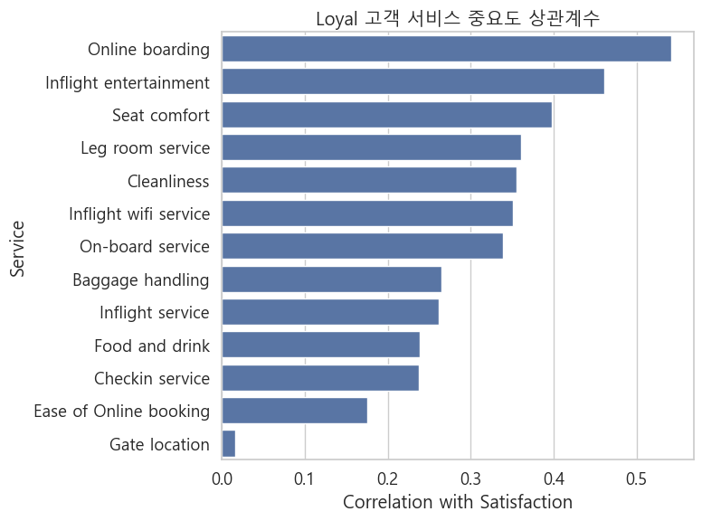
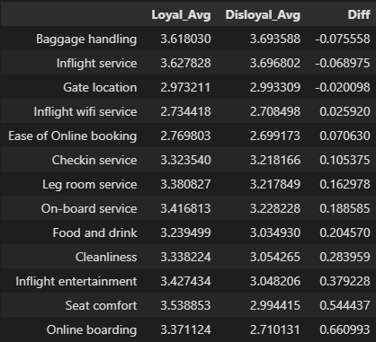

# 자주 이용하는 고객일수록 만족도가 높을까?

**반대로 충성 고객일수록 오히려 기대 수준이 매우 높아 만족도가 더 낮아지는 역효과는 없을까?**

**문제 정의:**
"충성 고객의 역설: 충성 고객은 정말 만족하는가, 아니면 더 크게 실망하는가?"
항공사는 “더 자주 이용하는 고객(Loyal Customer)이 더 높은 만족도를 가진다”라고 가정하고, 마일리지·라운지·우선 탑승·좌석 업그레이드 등 여러 혜택을 제공한다.
그러나 실제 데이터는 이 통념과 충돌한다.
본 분석은 그 충돌의 원인을 데이터 기반으로 해석하는 데 목적이 있다.

## 결론 요약

### 1. 충성 고객의 만족도는 절반을 넘지 못한다.

- Loyal 고객의 만족률: **약 47.7%**
- Disloyal 고객의 만족률: **약 23.7%**
  즉, 충성 고객이 만족 비율은 더 높지만, **절반 이상은 여전히 불만족 또는 중립**이다.
  → 충성 고객임에도 “브랜드 충성도 = 높은 만족도”라는 가정이 깨지고 있음.

### 2. 충성 고객과 비충성 고객의 서비스 평가 차이가 존재한다.

#### 충성 고객(Loyal Customer)

충성 고객은 아래 항목들이 만족도에 크게 기여했다:

→ 특징: **기본적인 승객 경험(좌석·청결·기내 서비스·오락)**에 점수가 민감하다.

#### 비충성 고객(Disloyal Customer)

비충성 고객은 완전히 다른 요소에 반응했다:

→ 특징: **이용 편의성(온라인 예약/탑승/와이파이)**에 훨씬 민감하다.

### 3. 충성 고객은 더 높은 점수를 줬지만, 만족도 상관계수는 더 낮다.

평균 서비스 점수 비교하면,

→ 거의 모든 서비스 점수가 충성 고객이 더 높음.

하지만 상관계수는 반대로 **Disloyal이 더 높음**
→ 충성 고객은 점수를 후하게 줘도 만족 여부(label)는 낮게 나오는 경향
→ **기대치가 높아서 쉽게 만족하지 않는 패턴**
→ “기대치 역설”을 강하게 지지하는 결과

### 4. 지연은 두 그룹에 거의 영향이 없다.

**1) 충성 고객(Loyal Customer)은 Delay에 더 강한가? -> 아니다**

- Departure Delay 상관:
  - Loyal: -0.0539
  - Disloyal: -0.0337
- Arrival Delay 상관:
  - Loyal: -0.0607
  - Disloyal: -0.0425

> 둘 다 절대값이 작고, Loyal이 약간 더 음수이지만 차이는 매우 미미함
> 충성 고객이라고 해서 지연에 '덜 화내는' 패턴은 없음

**2) 혜택의 완충 효과 증거가 없다.**
원래의 가설은,

> "충성 고객은 라운지, 마일리지 같은 혜택이 있어서 같은 지연 상황에서도 덜 불만족할 것이다."
> 그런데,

- Loyal도 Delay가 길어지면 Satisfaction 감소
- Disloyal도 Delay가 길어지면 Satisfaction 감소
- 둘 사이의 '완충' 차이는 거의 0에 가까움
  -> 혜택이 불만을 막아준다는 가설은 기각
  -> 충성 고객이 지연이 나면 그냥 똑같이(or 약간 더) 화난다.

**3) 오히려 기대치 역설이 더 그럴듯함**
비록 Delay의 상관 자체는 약하지만,

- Arrival Delay에 대한 Loyal의 상관(-0.0607)이 Disloyal(-0.042)보다 더 음수다.
  - 충성 고객이 오히려 지연에 조금 더 민감하게 반응한다.
  - 기대치가 높기 때문에 작은 지연에도 실망이 더 크게 나타날 가능성이 있다.

## 분석 과정

### 1. 데이터 로딩 및 satisfaction 라벨링

- satisfied = 1, neutral or dissatisfied = 0으로 변환
- 이후 만족도 분석은 모두 이 binary label 기준으로 수행

### 2. 서비스 점수의 ‘0점’을 결측치(NaN)으로 처리

- 0점은 "서비스를 이용하지 않았다"는 의미
  → 이용하지 않은 경우는 평가에서 제외해야 상관계수 왜곡이 없음
  → 모든 서비스 컬럼에서 0을 NaN으로 변경

### 3. 기본 만족도 비교

- 충성 고객 만족률: **47.7%**
- 비충성 고객 만족률: **23.7%**

### 4. 충성 고객의 서비스별 만족도 상관계수 계산

결과: 충성 고객은 기초적인 승객 경험 요소에 가장 큰 영향을 받음.

### 5. 비충성 고객의 서비스별 만족도 상관계수 계산

결과: 비충성 고객은 온라인 편의성 + 와이파이에 민감함.

### 6. 두 그룹의 서비스 중요도 비교

- 상관계수를 DataFrame으로 합쳐 시각화
- 충성 고객과 비충성 고객은 중요 서비스 항목의 “순위”와 “종류”가 완전히 다름을 확인

### 7. 서비스 점수 자체의 평균 비교

- 충성 고객의 서비스 점수가 전반적으로 더 높음
  → 하지만 상관계수는 더 낮음
  → 이것이 “기대치가 너무 높아 쉽게 만족하지 않는 패턴”을 보여줌

### 8. 지연(Delay)이 만족도에 미치는 영향 확인

- 충성/비충성 모두 영향 미미
- Delay 요소는 만족도 분석에서 거의 배제 가능

## 주의할 점 및 다음 단계

### 1. 상관관계의 한계 (주의할 점)

- 상관계수는 인과관계를 의미하지 않음
- 서비스 요소들이 서로 영향을 주는 복잡한 구조(상호작용 효과)는 설명할 수 없음
- 따라서 추가적인 모델링 분석 필요

### 2. 충성 고객 그룹 내부 세분화 필요 (다음 단계)

Loyal 그룹 내부에서 추가 세그먼트 분석을 진행해야 함:

- 비행 클래스(Eco / Business / Eco Plus)
- 비행 거리(단거리 / 중거리 / 장거리)
- 여행 목적(Personal / Business)

> 이러한 세그먼트를 통제하면
> “충성 고객 만족도가 낮은 진짜 원인”을 더 정확하게 파악할 수 있음.
