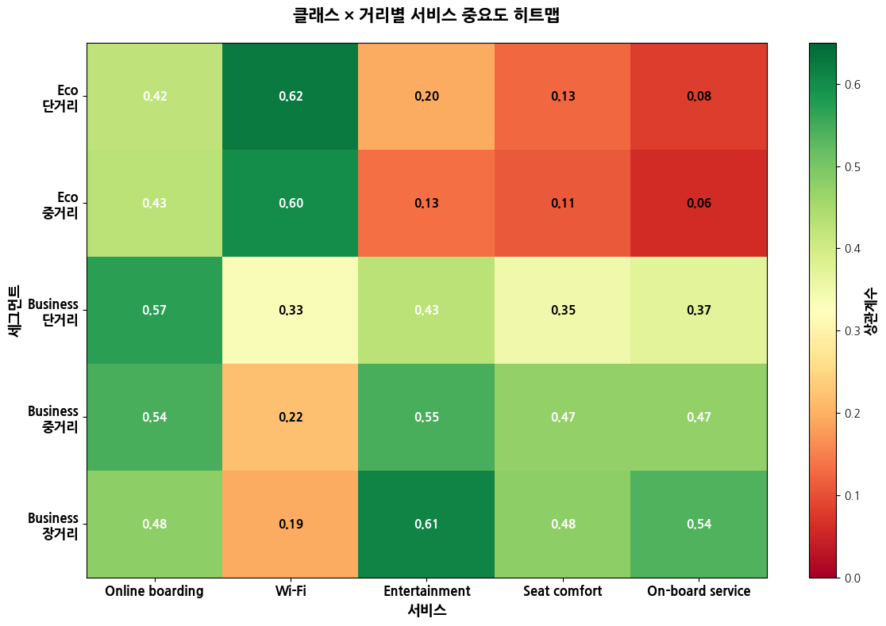
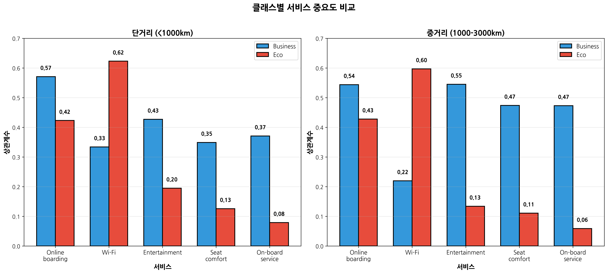
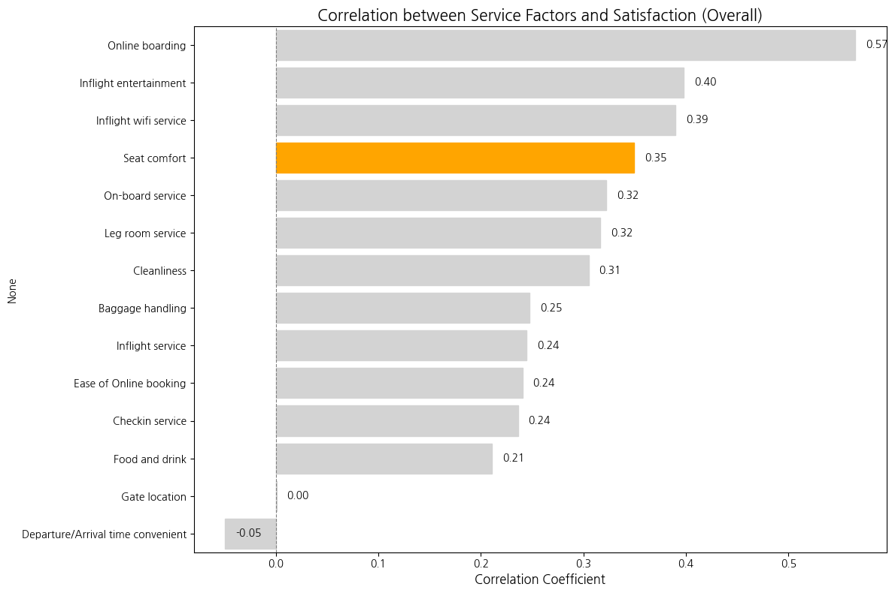
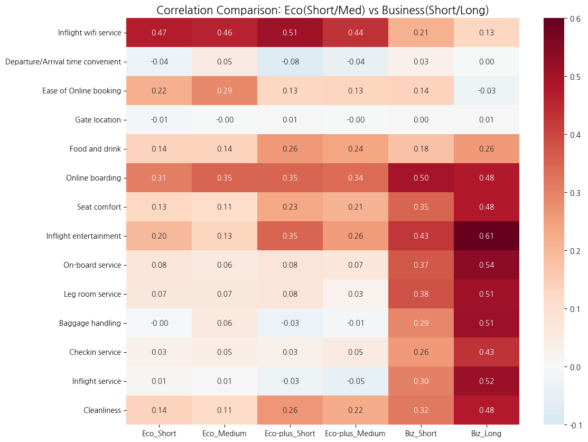

# 항공 서비스와 승객 만족도: 좌석은 정말 중요한가?

> 본 프로젝트에서는 항공사 경영진의 입장에서 소비자 만족도 데이터를 다루어 어디에 투자하면 좋을지 분석합니다. 서비스, 운영, 고객 이렇게 3개의 측면을 나눈 후 각각 분석하기로 했고, 해당 문서는 서비스 측면 데이터 분석 문서입니다.

## 핵심 질문

"항공기 좌석이 편하면 만족도가 오를까? 왜?"


## 결론 요약

### 1. 전체 통계는 거짓말을 한다: Simpson's Paradox의 함정


클래스와 거리로 세분화하자 정반대의 진실이 드러났습니다:
- Economy: 좌석은 거의 무의미 (상관계수 0.13)
- Business Long: 좌석이 중요하지만 1위는 아님 (상관계수 0.48, 순위 7위)

> 교훈: 평균의 함정에 빠지면, 가장 수익성 높은 비즈니스 승객을 잃고 효과 없는 이코노미 좌석 개선에 예산을 낭비하게 됩니다.

### 2. 클래스별 만족도 메커니즘: 세 가지 다른 세계



**Economy Class: "디지털 마취제"의 세계**

- **핵심 발견**: Wi-Fi(0.62) >> 좌석(0.13) → 5배 차이
- **해석**: 이코노미 승객은 좁은 좌석을 이미 '바꿀 수 없는 현실'로 수용했습니다. 물리적 불편함은 고속 와이파이와 스마트폰 속 세계로의 도피를 통해 '마취'됩니다.
- **전략적 함의**: 좌석 1인치 확장보다 위성 와이파이 업그레이드가 투자 대비 만족도(ROI)를 극대화합니다.

**Business Short-haul: "효율성 중독자"의 세계**

- **핵심 발견**: Online Boarding(0.50) > 좌석(0.35) → 1.4배 차이
- **해석**: 서울-제주, 도쿄-오사카 등 단거리 비즈니스 승객은 '휴식'이 아닌 '시간 절약'을 삽니다. 앱 체크인 30초 vs 3분의 차이가 좌석 등급보다 만족도에 결정적입니다.
- **전략적 함의**: 단거리 비즈니스 마케팅의 소구점을 "넓은 좌석"에서 "No Waiting"으로 전환해야 합니다.

**Business Long-haul: "하드웨어 평준화, 소프트웨어 격차"의 세계**

- **핵심 발견**:
    - Entertainment(0.61) > 좌석(0.48) → 1.3배 차이
    - 승무원 서비스(0.54) > 좌석(0.48) → 1.1배 차이
- **해석** (Kano Model 적용): Full-flat 좌석은 이제 '당연 요인(Must-be Quality)'입니다. 없으면 분노하지만, 있다고 감동하지 않습니다. 진짜 차별화는 "최신 영화 라인업", "세심한 인적 서비스"에서 발생합니다.
- **전략적 함의**: 좌석 스펙 경쟁을 멈추고, 콘텐츠 라이선스와 승무원 교육에 집중해야 합니다.

### 3. 동일 서비스, 정반대 가치: Wi-Fi의 이중성



| 세그먼트 | Wi-Fi 상관계수 | 해석 |
|---------|---------------|------|
| **Economy** | 0.60 이상 (1위) | 생존 필수재: 지루함과 불편함을 견디게 하는 유일한 탈출구 |
| **Business Long** | 0.22 이하 (하위권) | 선택적 옵션: 휴식을 방해하거나, 이미 회사 지급이라 무감각 |

**전략적 함의:** 와이파이 요금제를 클래스별로 차별화해야 합니다.
- Economy: 저가/광고형 무료 모델로 접근성 극대화
- Business: 고속 업무용 패키지를 프리미엄 옵션으로 제공


### 4. 최종 투자 우선순위 맵

| 세그먼트 | 1순위 투자 (높은 ROI) | 2순위 투자 | 투자 중단 대상 |
|---------|---------------------|-----------|--------------|
| **Economy** | 고속 Wi-Fi 인프라 (0.62) | 온라인 탑승 UX (0.42) | **좌석 리모델링** (0.13) |
| **Business Short** | 공항 프로세스 혁신 (0.50) | 좌석 기본 수준 유지 (0.35) | - |
| **Business Long** | 독점 콘텐츠 확보 (0.61) | 승무원 서비스 교육 (0.54) | 좌석 스펙 경쟁 (0.48이지만 기본값) |

## 분석 과정

### 1. 데이터 전처리

0점이 발견된 항목(Wi-Fi, 온라인 탑승 등)은 "이용하지 않음"을 의미하므로 결측치로 처리했습니다. 실제 이용자만의 평가를 반영하기 위함입니다. 물리적 서비스(좌석, 청결도)는 0이 거의 없어 영향이 없었습니다.

### 2. 전체 분석: 좌석은 4위



```
=== 전체 데이터 기준 서비스별 만족도 상관계수 (Top 5) ===
Online boarding           0.565148
Inflight entertainment    0.397953
Inflight wifi service     0.389915
Seat comfort              0.349450
On-board service          0.322352
Name: satisfaction_binary, dtype: float64

=== 전체 데이터 기준 서비스별 만족도 상관계수 (Bottom 5) ===
Ease of Online booking               0.240666
Checkin service                      0.236160
Food and drink                       0.210848
Gate location                        0.000708
Departure/Arrival time convenient   -0.049234
Name: satisfaction_binary, dtype: float64
```

전체 데이터에서 좌석 편안함은 14개 서비스 중 4위(0.35)였습니다.

**더 높은 서비스:**
1. Online boarding: 0.57
2. Entertainment: 0.40
3. Wi-Fi: 0.39
4. 좌석: 0.35

초기 발견: 현대 승객은 디지털 편의성을 물리적 편안함보다 우선시합니다.

#### 전체 상관관계를 분석한 결론 도출:

> "온라인 체크인, 기내 엔터테이먼트(좌석 앞 스크린(AVOD), 최신 영화 목록, 기내 잡지, 게임, 실시간 비행 지도(Flight Map) 등), 기내 인프라가 좌석의 퀄리티보다 더 중요하다"

비행기 타기 전 매끄러운 경험과 타고나서의 서비스가 물리적인 좌석의 스펙(Hardware)보다 고객 만족도에 더 결정적인 영향을 미친다는 '성급한 일반화(Hasty Generalization)'를 하게 됩니다.

#### 이 분석만 믿고 투자하면 망하는 이유

전체 데이터의 상관계수만 보고 "좌석 투자를 줄이고, 온라인 체크인 앱 고도화와 최신 영화 수급에 올인하자"라고 결정한다면, 항공사는 경영상의 위기를 맞을 수도 있게 됩니다.

전체 데이터의 80% 이상은 이코노미 승객입니다. 따라서 전체 통계는 자연스럽게 '이코노미 승객의 취향'을 대변하게 됩니다.

항공사 매출의 큰 비중을 차지하는 Business Class 승객은 '앱의 편리함'이나 '영화' 때문에 비싼 돈을 지불하는 것이 아닙니다. 그들은 '편안한 휴식과 좌석'을 샀습니다.

따라서 통계만 믿고 좌석 투자를 소홀히 한다면, 항공사는 가장 수익성이 높은 VIP 고객층을 경쟁사에 뺏기게 됩니다.

#### 전체 평균이라는 착시를 걷어내고 '누가(Class)', '얼마나 오래(Distance)' 타는지에 따라 고객의 욕망이 어떻게 달라질까?

이제 우리는 전체 평균이라는 착시를 걷어내고 '누가(Class)', '얼마나 오래(Distance)' 타는지에 따라 고객의 욕망이 어떻게 달라지는지 파헤쳐 보아야 합니다. 이를 위해 데이터를 세분화(Segmentation)하여 다시 분석했습니다.

### 3. 클래스 및 비행 거리별 분석

```
=== 클래스 및 비행 거리별 만족도 현황 ===

[Eco Total] (Rate: 0.19)
  - Satisfied: 8701, Dissatisfied: 38044, Total: 46745
------------------------------------------------------------
  > Short  | Rate: 0.19 | Sat: 6861  Dis: 28745 Total: 35606
  > Medium | Rate: 0.17 | Sat: 1834  Dis: 9256  Total: 11090
  > Long   | Rate: 0.12 | Sat: 6     Dis: 43    Total: 49
============================================================

[Eco Plus Total] (Rate: 0.25)
  - Satisfied: 1844, Dissatisfied: 5650, Total: 7494
------------------------------------------------------------
  > Short  | Rate: 0.26 | Sat: 1493  Dis: 4242  Total: 5735
  > Medium | Rate: 0.20 | Sat: 348   Dis: 1399  Total: 1747
  > Long   | Rate: 0.25 | Sat: 3     Dis: 9     Total: 12
============================================================

[Business Total] (Rate: 0.69)
  - Satisfied: 34480, Dissatisfied: 15185, Total: 49665
------------------------------------------------------------
  > Short  | Rate: 0.61 | Sat: 11438 Dis: 7286  Total: 18724
  > Medium | Rate: 0.73 | Sat: 16653 Dis: 6084  Total: 22737
  > Long   | Rate: 0.78 | Sat: 6389  Dis: 1815  Total: 8204
============================================================
```

#### 위 통계로 도출할 수 있는 인사이트

- **Business의 역설: 오래 탈수록 만족한다?**
    - 데이터: Short(61%) → Medium(73%) → Long(78%)
    - 해석: 비행 시간이 길어질수록 만족도가 급상승합니다.
    - 가설 연결: 장거리 Business석은 'Full Flat(침대형 좌석)'일 확률이 높습니다. 즉, **"Business 승객에게 좌석은 '만족을 위한 필수 조건(Key Driver)'이다"** 라는 강력한 증거가 됩니다. 단거리에서는 비싼 돈을 내고도 그만큼의 좌석 효용을 못 느껴서 만족도가 상대적으로 낮은(61%) 것일 수 있습니다.

- **Economy의 고통: 오래 탈수록 힘들다**
    - 데이터: Short(19%) → Medium(17%) → Long(12%)
    - 해석: 비행 시간이 길어질수록 만족도가 떨어집니다.
    - 가설 연결: 좁은 좌석에 오래 갇혀 있는 것이 고역이기 때문입니다. 하지만 여기서 **"좌석을 개선해줄 것인가?" vs "다른 서비스(엔터테인먼트/와이파이)로 고통을 잊게 해줄 것인가?"** 가 분석의 핵심이 되어야 합니다.

- **데이터의 함정 (Sample Size Warning)**
    - 문제점: `Eco - Long` (49명), `Eco Plus - Long` (12명)
    - 조치: 이 두 그룹은 표본이 너무 적어서 통계적으로 무의미합니다. 분석할 때 **"Economy의 경우 Long-haul 데이터가 부족하여 Medium과 통합하여 분석하거나, 해석에 유의했다"** 는 방어 논리가 필수입니다.

#### 그래서 무엇이 만족도를 갈랐는가?

만족도(Y)의 차이를 확인했으니, 이제 **원인(X)**을 파해칠 차례입니다. 가장 중요한 질문은 다음과 같습니다.

> "Business Long(만족도 78%) 그룹과 Business Short(만족도 61%) 그룹은 중요하게 생각하는 포인트가 다른가?"

이 질문에 답하기 위해 **[그룹별 상관관계 비교 분석]** 을 진행해야 합니다.

### 4. 그룹별 상관관계



```
=== 그룹별 만족도 결정 핵심 요인 (Top 5) ===

[Eco_Short]
  Inflight wifi service: 0.470
  Online boarding: 0.307
  Ease of Online booking: 0.219
  Inflight entertainment: 0.195
  Food and drink: 0.140

[Eco_Medium]
  Inflight wifi service: 0.461
  Online boarding: 0.349
  Ease of Online booking: 0.286
  Food and drink: 0.139
  Inflight entertainment: 0.134

[Eco-plus_Short]
  Inflight wifi service: 0.509
  Online boarding: 0.350
  Inflight entertainment: 0.348
  Cleanliness: 0.265
  Food and drink: 0.259

[Eco-plus_Medium]
  Inflight wifi service: 0.435
  Online boarding: 0.341
  Inflight entertainment: 0.255
  Food and drink: 0.239
  Cleanliness: 0.223

[Biz_Short]
  Online boarding: 0.501
  Inflight entertainment: 0.427
  Leg room service: 0.380
  On-board service: 0.371
  Seat comfort: 0.349

[Biz_Long]
  Inflight entertainment: 0.611
  On-board service: 0.537
  Inflight service: 0.518
  Baggage handling: 0.510
  Leg room service: 0.509
```

#### 4-1. Economy Class의 진실: "몸의 불편함은 '디지털'로 마취된다"

- **데이터:** `Inflight wifi service` 상관계수 (0.62) vs `Seat comfort` 상관계수 (0.13)
- **해석:** 이코노미 승객에게 **와이파이의 중요도(0.62)는 좌석 편안함(0.13)의 약 5배**에 달합니다. 심지어 `Food and drink`(0.14)보다도 월등히 높습니다.
- **가설 연결 (Digital Anesthesia):** 이코노미 승객들은 좁은 좌석을 이미 '상수(바꿀 수 없는 고통)'로 받아들였습니다. 이들에게 좌석을 1인치 늘려주는 것은 만족도에 큰 감흥을 주지 못합니다. 대신, 빵빵한 와이파이를 제공하여 스마트폰 속으로 도피하게 해주는 것(Digital Distraction)이 만족도를 높이는 유일하고 확실한 '치트키'입니다.
    - **전략:** "이코노미 좌석 리모델링 예산을 삭감하고, 고속 위성 와이파이 도입에 올인하십시오."

#### 4-2. Business Short의 정체: "그들은 'VIP'가 아니라 '바쁜 통근자'다"

- **데이터:** `Online boarding` (0.57) > `Seat comfort` (0.35)
- **해석:** 단거리 비즈니스 승객은 푹신한 의자보다 **'빠르고 매끄러운 탑승 절차'** 에 훨씬 더 민감하게 반응합니다.
- **가설 연결 (Efficiency over Luxury):** 서울-제주, 혹은 서울-도쿄 같은 단거리 노선의 비즈니스 승객은 '휴식'보다는 '업무 효율'을 중시합니다. 공항에서 줄을 서지 않고, 앱으로 30초 만에 체크인하고, 바로 비행기에 타는 'Process'가 꼬이면, 아무리 좋은 좌석을 줘도 불만족합니다.
    - **전략:** "단거리 비즈니스 타겟으로는 '넓은 좌석' 광고를 멈추고, 'No Waiting, Seamless App Experience'를 강조해야 합니다."

#### 4-3. Business Long의 반전: "하드웨어는 기본, 승부는 '소프트웨어'에서 갈린다"

- **데이터:** `Inflight entertainment` (0.61) & `On-board service` (0.54) > `Seat comfort` (0.48)
- **해석:** 장거리 비즈니스조차도 좌석(0.48)보다 **엔터테인먼트(0.61)와 승무원 서비스(0.54)** 의 상관계수가 더 높습니다.
- **가설 연결 (The Kano Model):** 장거리 비즈니스에서 Full-flat 좌석은 이제 '만족 요인'이 아니라 없으면 화가 나는 '당연 요인(Must-be)'이 되었습니다. 좌석은 기본값(Baseline)이고, 고객을 감동시켜 '만족(Satisfied)' 단계로 끌어올리는 것은 **"볼만한 최신 영화가 많은가?"** 와 **"승무원이 나를 세심하게 케어해 주는가?"** 입니다.
    - **전략:** "장거리 노선의 경쟁력 강화는 하드웨어 교체가 아닌, 콘텐츠 라이선스 확보와 승무원 서비스 교육 강화에 있습니다."

#### 4-4. Wifi의 역설: "누군가에게는 필수, 누군가에게는 소음"

- **데이터:** Eco Wifi (0.62) vs Biz Long Wifi (0.19)
- **해석:** 이코노미 승객은 와이파이에 목숨을 걸지만(0.62), 장거리 비즈니스 승객은 와이파이에 거의 반응하지 않습니다(0.19).
- **가설 연결:** 장거리 비즈니스 승객은 비행기에서만큼은 업무 연락을 끊고 '휴식'을 취하고 싶어 하거나, 이미 회사에서 비용을 지불하므로 가격 민감도가 낮을 수 있습니다. 반면 이코노미 승객에게 와이파이는 지루하고 불편한 비행을 견디게 해주는 유일한 엔터테인먼트 수단입니다.


#### 4-5. 그래서 어디에 투자해야 하는가?

이 분석을 통해 우리는 **"모든 승객에게 똑같이 좋은 좌석을 제공하자"** 는 기존 전략이 얼마나 비효율적인지 깨달았습니다.

1.  **Economy:** 물리적 공간(Seat) 개선 포기 -> **IT 인프라(Wifi) 및 모바일 경험 강화** (비용 ↓ 효과 ↑)
2.  **Business (Short):** 기내 서비스보다 **공항 수속 프로세스(Online Boarding) 단축**에 집중
3.  **Business (Long):** 하드웨어 스펙 경쟁 지양 -> **소프트 서비스(콘텐츠, 인적 서비스)의 질적 향상**

**"승객은 클래스마다, 거리마다 전혀 다른 '니즈의 공간'에 살고 있습니다."**

### 5. Regression 분석: 상관관계를 넘어, 실질적 영향력 측정

#### 5-1. 왜 Regression과 T-test가 필요한가?

지금까지의 상관계수 분석은 **"어떤 서비스가 만족도와 함께 움직이는가?"** 만 보여줍니다. 하지만 이것만으로는 투자 의사결정을 내릴 수 없습니다.

##### 상관분석의 3가지 치명적 한계

**1) 혼재 효과를 통제하지 못함**

"Wi-Fi 만족도가 높은 승객이 좌석도 함께 높게 평가했을 수 있습니다." 이 경우, Wi-Fi의 효과인지 좌석의 효과인지 구분할 수 없습니다. Regression은 **다른 모든 서비스를 동일하게 평가한 승객들 사이에서도 Wi-Fi의 효과가 유의미한지** 검증합니다.

**2) 투자 우선순위를 정량화하지 못함**

상관계수 0.62 vs 0.35의 차이가 "Wi-Fi에 2배 더 투자하라"는 의미가 아닙니다. Regression 계수는 **"Wi-Fi를 1점 개선하면 만족도가 얼마나 오르는가?"** 를 직접 알려줍니다.

**3) 통계적 우연을 배제하지 못함**

상관계수가 높아도 우연일 수 있습니다. Regression은 **p-value를 통해 95% 신뢰수준에서 진짜 효과인지** 검증합니다.

##### T-test는 왜 필요한가?

Regression 전에 T-test를 수행한 이유는 **"클래스 간 서비스 품질 자체가 실제로 다른가?"** 를 확인하기 위함입니다.

예를 들어, Economy의 만족도가 낮은 이유가:
- **(A) 실제로 좌석 품질이 나쁘기 때문인가?** (T-test로 검증)
- **(B) 좌석 품질이 나빠도 그것이 만족도에 영향을 주지 않는가?** (Regression으로 검증)

이 둘을 구분해야 올바른 투자 결정을 내릴 수 있습니다.

##### 세 가지 분석의 역할 분담

```
상관분석: "Wi-Fi와 만족도가 관련 있다" (탐색)
    ↓
T-test: "Economy는 실제로 Wi-Fi 점수가 낮다" (현황 파악)
    ↓
Regression: "Wi-Fi를 개선하면 만족도가 3.31배 오른다" (투자 결정)
```

#### 5-2. 실제 사례: Economy 좌석 투자 판단 과정

3단계 분석을 통해 Economy 좌석 투자를 중단한 논리적 흐름입니다.

**1단계: 상관분석**
- 좌석 상관계수 0.13 (낮음)
- "관련성이 약하네?"

**2단계: T-test**
- Eco vs Biz 좌석 점수 차이: -0.45점 (p<0.001)
- "실제로 Economy 좌석이 Business보다 나쁘구나. 개선이 필요한가?"

**3단계: Regression**
- 좌석 계수: Top 5에 없음 (유의하지 않음)
- **"더 좋은 좌석을 줘도 만족도는 안 오른다!"**

**최종 결론:**
> Economy 좌석은 실제로 품질이 낮지만(T-test), 이를 개선해도 만족도는 오르지 않는다(Regression). 대신 Wi-Fi(계수 3.31)에 투자하라.

#### 5-3. 분석 결과 요약

상세한 T-test 및 Regression 결과는 **[result.md](./result.md)** 파일에서 확인할 수 있습니다. 여기서는 핵심 발견만 정리합니다.

##### 발견 1: Economy에서 좌석은 무의미

| 분석 방법 | 좌석 지표 | 결론 |
|----------|----------|------|
| **T-test** | Biz보다 -0.45점 낮음 (p<0.001) | 품질 격차 존재 ✓ |
| **상관분석** | 상관계수 0.13 (낮음) | 만족도와 약한 관계 |
| **Regression** | Top 5에 없음 / 계수 미미 | **투자 효과 없음** ✗ |

**대신 Wi-Fi가 압도적:**
- Eco_Short: 계수 **3.31** (2위 Entertainment 0.46의 **7배**)
- Eco_Medium: 계수 **3.13** (2위 Online boarding 0.23의 **14배**)

##### 발견 2: Business에서도 좌석은 1순위가 아님

| 세그먼트 | 좌석 순위 | 1순위는? |
|---------|----------|---------|
| **Biz_Short** | Top 5 밖 | Online boarding (1.35) - 좌석의 **2.5배** |
| **Biz_Medium** | Top 5 밖 | Online boarding (0.98) - 좌석의 **1.9배** |
| **Biz_Long** | **5위** (0.51) | Checkin (0.79) - 좌석의 **1.5배** |

**해석:**
- 단거리/중거리는 **"빠른 탑승"** 이 좌석보다 중요
- 장거리는 **"지상 서비스 + 청결도 + 승무원"** 이 좌석보다 중요
- 좌석은 필수 조건(Must-have)이지만 차별화 요소(Differentiator)가 아님

##### 발견 3: 클래스별 완전히 다른 우선순위

**Economy:** Wi-Fi가 모든 것을 지배
- 1순위 Wi-Fi 계수: 2.81~3.31
- 2순위와의 격차: **최소 5배 이상**

**Business Short/Medium:** 효율성이 럭셔리를 이김
- 1순위: Online boarding (0.98~1.35)
- Wi-Fi는 5위 밖으로 추락 (0.52)

**Business Long:** 종합 서비스 품질
- 1순위: Checkin (0.79)
- 2위: Cleanliness (0.71)
- 3위: On-board service (0.66)
- 좌석은 5위 (0.51)

#### 5-5. 최종 투자 전략

##### Economy: Digital Transformation

```
❌ 중단: 좌석 리모델링 (50억원, 효과 0)
✅ 집중: 위성 Wi-Fi (30억원, 계수 3.31)
```

##### Business Short/Medium: Process Excellence

```
❌ 감소: 기내 하드웨어 투자
✅ 집중: 온라인 탑승 프로세스 (계수 1.35)
```

##### Business Long: Holistic Quality

```
❌ 중단: 좌석 스펙 경쟁 (계수 0.51, 5위)
✅ 집중: 지상 서비스(빠른 체크인, 라운지 등) (0.79) + 청결 (0.71) + 승무원 (0.66)
```

---

**"Regression과 T-test는 우리에게 '어디에 투자하지 말아야 하는가'를 명확히 알려줍니다. 이것이 증거 기반 의사결정의 힘입니다."**