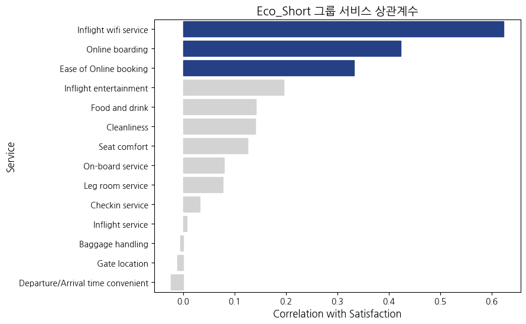
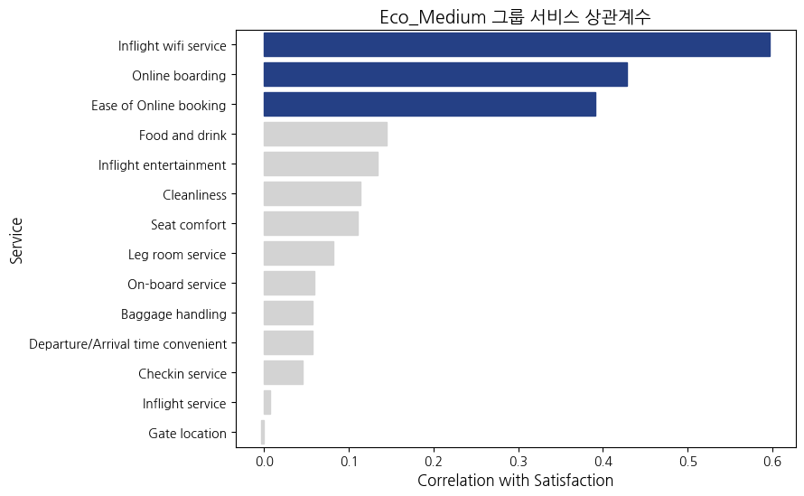
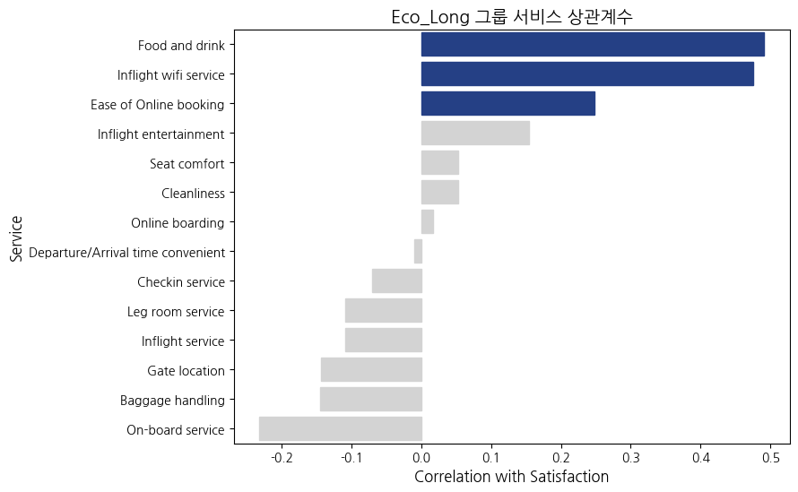
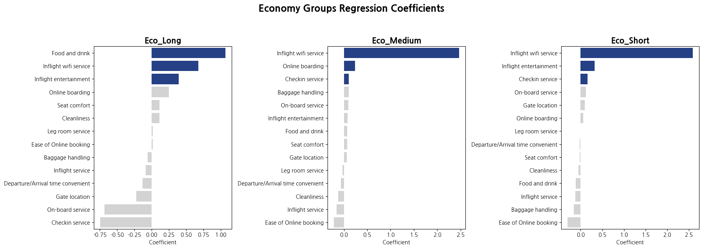
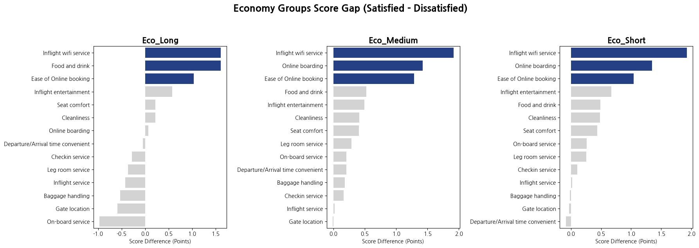
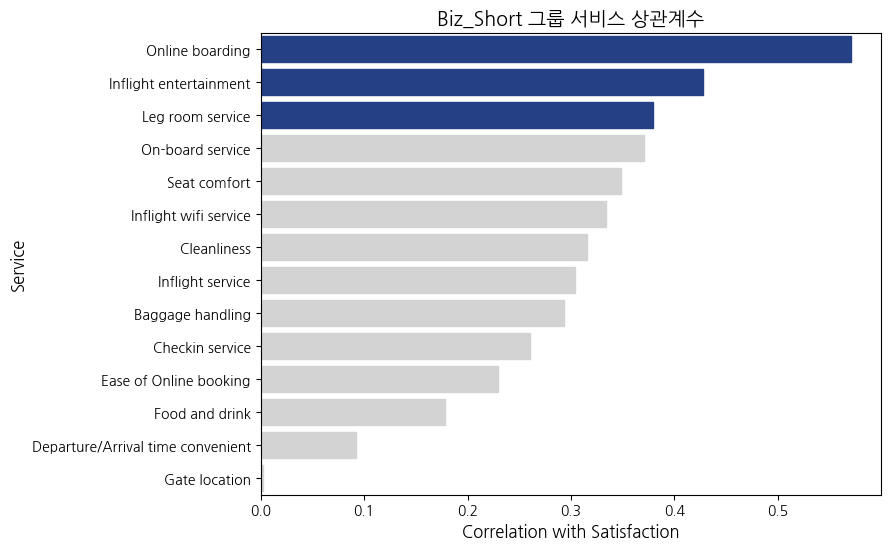
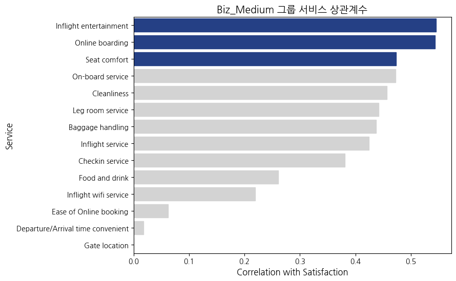
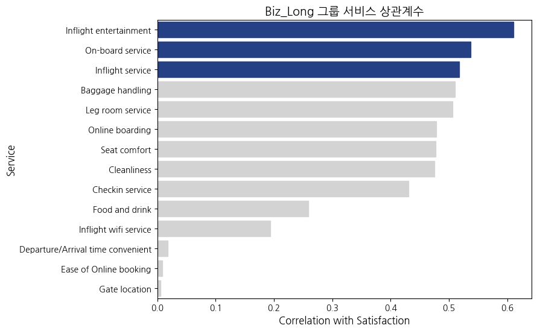
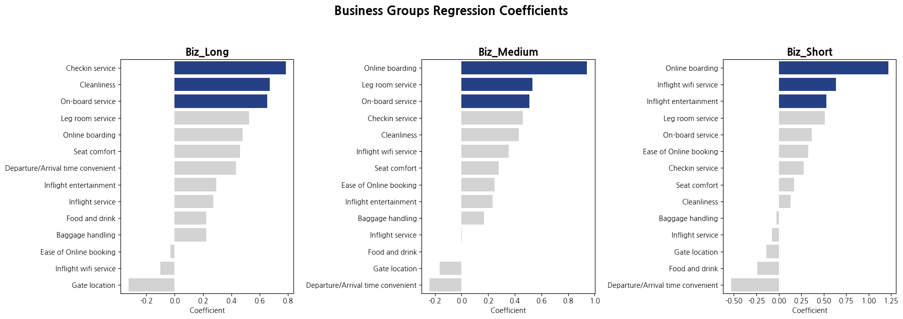
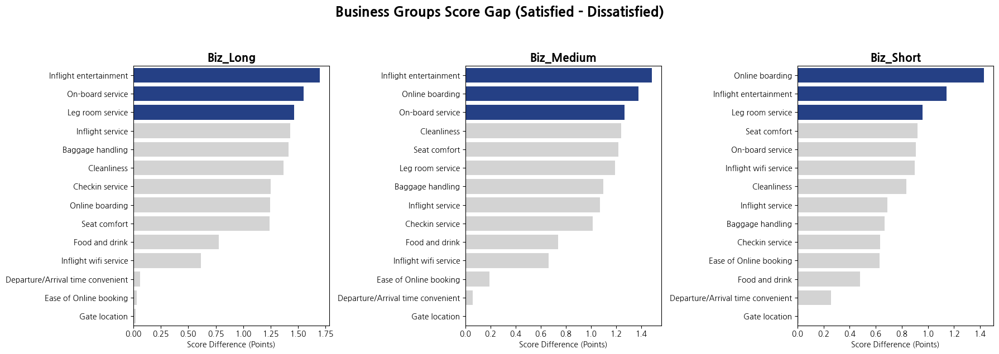

### 이코노미와 비즈니스 서비스 차별화

일부 서비스 간 상관관계가 높아, 단일 분석으로는 정확한 우선순위를 정하기 어려웠습니다. 따라서 상관관계로 연관성을 보고, 회귀분석으로 다른 변수들이 일정할 때의 효과를 확인하고, t-test로 실질적인 점수 격차를 검증했습니다. 세 가지 결과가 모두 일치하는 서비스에 투자 우선순위를 부여했습니다.

1. **상관관계 분석**: 서비스와 만족도의 연관성 파악
2. **로지스틱 회귀분석**: 다른 변수들이 일정할 때에도 유효한지 검증
3. **Welch's T-test**: 만족/불만족 그룹 간 실질적인 점수 격차 확인 및 통계적 유의성 검증
- **가설 H₀ (귀무가설)**: 만족 그룹과 불만족 그룹 간 서비스 점수 평균에 차이가 없다.
- **가설 H₁ (대립가설)**: 만족 그룹과 불만족 그룹 간 서비스 점수 평균에 유의미한 차이가 있다.

> Q. 왜 spearman 상관관계를 채택했는가?
> - 데이터가 정규성 가정을 만족하지 않거나, 변수가 **서열 척도(Ordinal Scale)** 로 구성되어 있기 때문

> Q. 왜 logistic regression을 사용했는가?
> - 종속변수가 만족/불만족 이진 변수이기 때문
> - 다른 서비스를 통제한 상태에서 각 서비스의 독립적 효과(Odds Ratio)를 정량적으로 파악 가능

> Q. T-test 전에 각 그룹별로 독립성, 정규성 그리고 등분산을 확인하였는가? 
> - **독립성**: 각 승객은 독립적인 응답자로 독립성 가정 만족
> - **정규성**: 1~5점 이산형 척도는 평균 주위에 정규분포로 퍼질 수 없는 구조적 한계가 있습니다. (100점 척도는 평균 50점 근처에 45~55점으로 분포 가능하나, 5점 척도는 평균 3점이면 2, 4점에만 분포하여 정규분포 불가) Shapiro-Wilk test에서도 모든 서비스가 p<0.05였습니다. 그러나 시각화 결과 각 그룹이 평균 중심으로 종 모양 분포를 보였고, 표본 크기(n>1000)가 충분히 커 중심극한정리에 의해 표본 평균의 분포는 정규에 근사하므로 t-test를 적용하였습니다.
> - **등분산성**: Levene's test(레빈 검정) 결과 p<0.05로 등분산 가정이 위배된 서비스도 있었고, 아닌 서비스도 있었습니다. 따라서 Welch's t-test(equal_var=False)를 사용하여 등분산 가정 없이도 정확한 검정을 수행했습니다.

이코노미 상관관계 결과:

이코노미 회귀분석 결과:

이코노미에서 상관관계와 회귀분석은 같은 방향의 결과 바라보고 있습니다. 거리에 상관없이 Wi-Fi와 온라인 탑승 수속이 상위권을 차지하고 있습니다. 상위권이라고 예측했던 좌석은 오히려 이코노미에서 중요하지 않았습니다.

(`Eco_Long`(이코노미-장거리) 경우에는 음식과 음료의 퀄리티도 중요하다고 나왔음. 하지만 데이터 수가 상대적으로 매우 적어 참고 지표로만 사용)

T-test 결과 모든 항목의 P-value < 0.05로 **귀무가설(H₀)을 기각**하였으며, 만족/불만족 그룹 간 서비스 점수에 통계적으로 유의미한 차이가 있음이 확인되었습니다. 따라서 **이코노미는 와이파이 인프라에 우선적으로 투자**해야 한다고 제안할 수 있습니다.

비즈니스 상관관계 결과:

비즈니스 회귀분석 결과:

비즈니스는 거리별로 승객이 원하는 가치가 명확히 달라졌습니다. 단거리/중거리에서는 와이파이를 제외하고, 이코노미처럼 '온라인 탑승 수속', '기내 엔터테인먼트'가 중요했습니다. 중거리부터는 기내 서비스의 상관계수와 회귀 계수가 증가하기 시작했습니다.

장거리로 가면 청결도, 기내 서비스, 승무원 친절도 등 서비스 변수들이 더 중요했습니다. 단거리에서 중거리, 장거리로 갈 수록 승객의 핵심 니즈가 '시간 효율(Efficiency)'에서 '비행 경험(Experience)'으로 이동하는 경향을 확인할 수 있습니다.

추가로 이코노미와 달리 좌석의 중요도가 많이 올라갔습니다. 하지만 우선 투자하라고 제안할 수는 없는 정도입니다.

T-test의 결과 방향도 동일하고, P-value < 0.05로 **귀무가설(H₀)을 기각**하였으며, 만족/불만족 그룹 간 서비스 점수에 통계적으로 유의미한 차이가 있음이 확인되었습니다.

따라서 비즈니스 클래스는 거리별로 차별화된 '투 트랙(Two-track)' 전략이으로 단·중거리는 **앱(App) 리뉴얼과 셀프 체크인 프로세스 강화를 통해 탑승 수속 시간을 단축**하는 데 투자해야 한다고 제안할 수 있습니다.

장거리의 핵심 가치는 '휴먼 터치(Human Touch)'와 '경험'으로 **'기내 엔터테인먼트 콘텐츠 확보'** 와 **'승무원 서비스 교육'** 에 예산을 집중하라고 제안할 수 있습니다.

만약 좌석에 투자를 하고 싶다면, 일부 다리 공간이 좁은 기재에 대해서 선별적으로 좌석 개선을 고려하라고 제안할 수 있습니다.