# 항공사는 어디에 투자해야 고객 만족도를 단기간에 끌어올릴 수 있을까?

## 1. 개요 및 데이터 설명

**'항공사는 어디에 투자해야 고객 만족도를 단기간에 끌어올릴 수 있을까?'** 를 주제로 분석

데이터 간단하게 설명: 데이터는 약 10만 명의 익명 항공사 승객 데이터를 사용 등

전체 만족도를 보여주면서 **절반도 만족을 안한다고 강조**

첫 번째 의문: **그렇다면 충성 고객은 만족할까???**

> 길어야 1분

## 2. 충성 고객 분석 & 문제 인식

충성 고객은 비충성 고객보다 만족도 2배 높았음.
하지만 충성 고객의 절반도 만족을 못함.

두 그룹(충성/비충성)이 선호하는 서비스 중 어느것을 만족시키면 그룹 전체 만족도가 효율적으로 올라갈지 분석

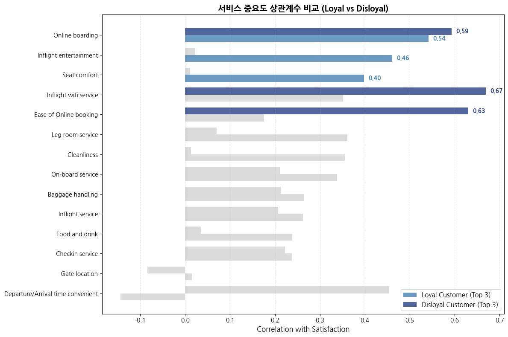

충성/비충성 고객이 중요하게 생각하는 서비스가 완전히 다르며, **충성 고객은 좌석·청결·기내서비스 등 기본 경험을 선호**하고, **비충성 고객은 온라인·탑승·Wi-Fi 등 편의성을 선호**하는 것을 확인 가능

그런데 이 차이가 정말 "충성도" 때문인지 확신할 수 없음.
충성 고객과 비충성 고객에서 클래스의 차이를 보여줌.

```
Loyal 고객 중 Business 비율 : 0.4982
Disloyal 고객 중 Business 비율 : 0.3875
```

충성 고객에서 비즈니스 분포가 11% 더 높음. 즉, "충성 고객이 좌석을 중요하게 생각한다"는 결과는, 사실 충성도 때문이 아니라 **"그들 중 상당수가 비즈니스석에 타고 있기 때문"** 일 가능성이 있음 (Confounding:혼재효과)

따라서 분석의 방향을 **'충성도'** 에서 **'좌석 등급(Class)'** 으로 과감히 전환. 이유는 실제로 충성/비충성 고객에게 차별 대우는 쉽지 않음. 오히려 클래스(좌석)별 서비스 차별화는 실제로 실행 가능한 전략임.

여기에 **'비행 거리(Distance)'** 라는 변수까지 더해, 더욱 정밀한 타겟팅 전략을 분석. 비행거리에 따라 기체가 다르기 때문에, 기체마다 서비스 차별화는 실제로 실행 가능한 전략

## 3. 클래스별·거리별로 어떤 서비스가 만족도에 영향을 미칠까? 특히, 충성 고객 분석에서 3위였던 좌석이 정말 중요할까?

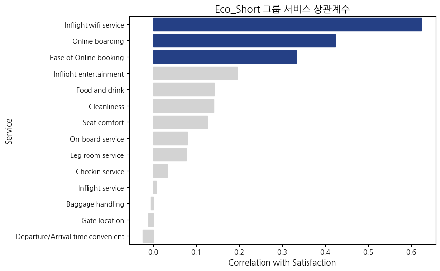

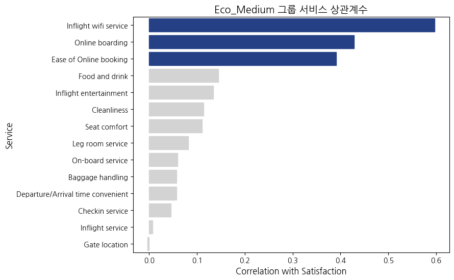

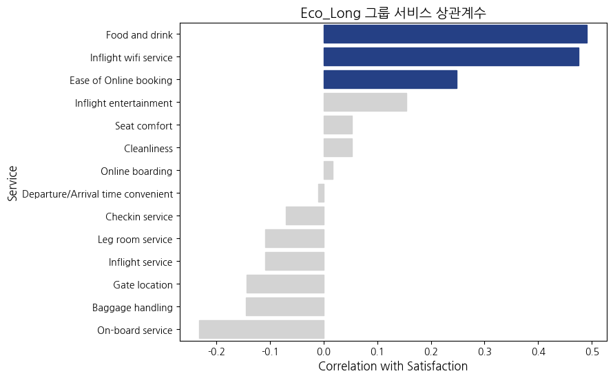

이코노미석은 거리에 큰 영향을 받지 않으며, 좌석의 안락함(Seat)보다 **연결성(Connectivity)을 더 선호**. 모든 거리에서 Wi-Fi와 온라인 체크인이 상위권을 차지하고 있음.

반면, 좁은 좌석 때문에 가장 불만일 것이라 예상했던 **좌석 편안함(Seat comfort)** 과 **다리 공간(Leg room)** 은 의외로 하위권에 머무르고 있음.

`Eco_Long` 경우에는 음식과 음료의 퀄리티도 중요하다고 나왔음. 하지만 데이터 수는 49개로 상대적으로 적으니 참고 지표로만 사용

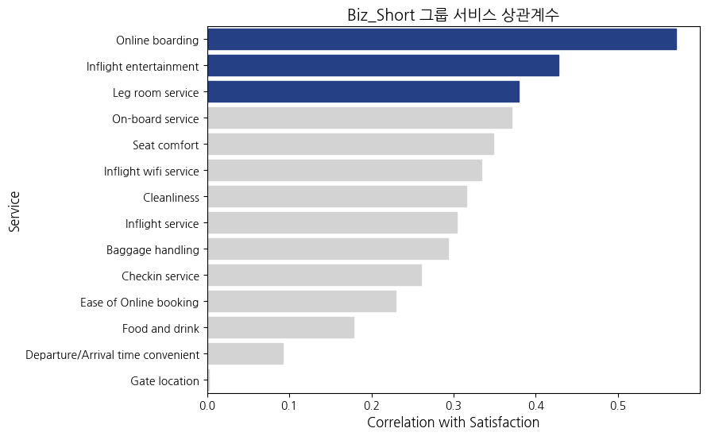

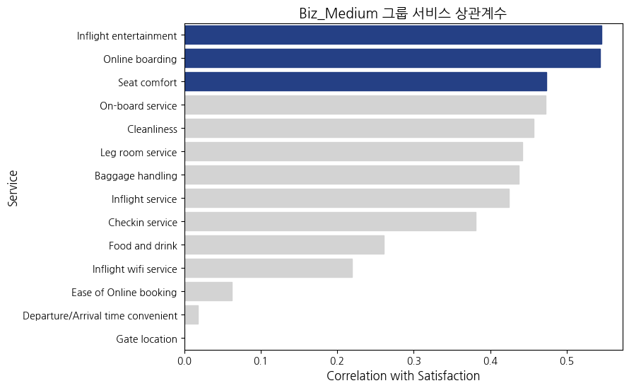

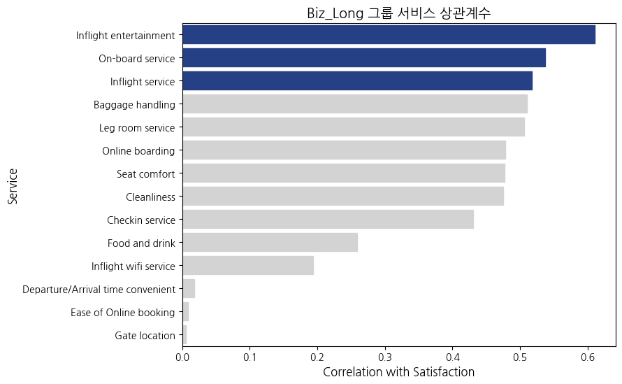

비즈니스는 거리에 따라 영향을 크게 받으며, **단·중거리**의 핵심은 **'효율'** 임. **온라인 탑승 수속(Online boarding)** 과 **기내 엔터테이먼트(Inflight entertainment)** 가 1, 2위를 다투고 있음. 

이코노미와는 다르게 wifi가 중요하지 않음. 좌석의 경우 이코노미와 달리 단거리에서는 다리 공간(Leg room service), 중거리는 시트의 편안함(Seat comfort)이 각각 3위까지 올라왔음.

반면 **장거리**는 **'경험'** 이 중요. 기계적인 수속보다 **'승무원 서비스'** 와 **'기내 엔터테인먼트'** 가 최상위권을 장악.

여기서 가장 중요한 점은 **'좌석(Seat comfort)'의 위치**임.
비즈니스 장거리에서는 좌석은 **'기본 조건(Hygiene Factor)'** 일 뿐, 만족도를 폭발시키는 **'게임 체인저'** 는 아니라는 것임.

만약 좌석을 개선할 것이면 단·중거리 노선에 투입되는 기체에만 투자해야함. 하지만 그보다 우선인건 기내 엔터테이먼트와 빠른 수속임.


## 4. 상관분석의 한계: 이대로 결론 내릴 수 있을까?

상관분석의 한계를 극복하기 위해, **로지스틱 회귀분석(Logistic Regression)** 을 수행. 이 분석은 다른 모든 서비스 변수들을 **통제(Control)** 한 상태에서, 특정 서비스가 1단위 좋아질 때 **만족할 확률(Odds)** 이 얼마나 증가하는지를 **계수(Coefficient)** 로 보여줌. 즉, 진짜 영향력을 의미함.

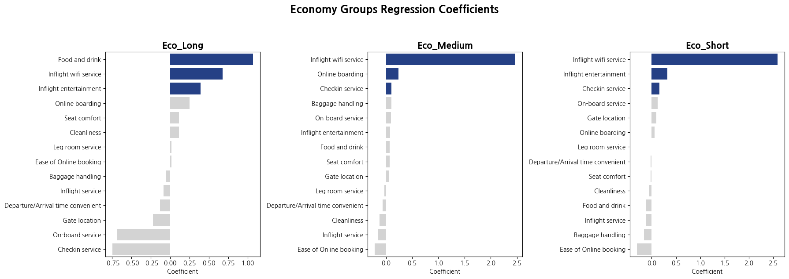

Eco_Short와 Eco_Medium 그래프에서 **'Inflight Wi-Fi'** 가 압도적으로 높은 것을 확인할 수 있음. 다른 항목들의 계수가 0.1~0.2 수준일 때, Wi-Fi 혼자 2.5를 넘나들고 있음. 

이것은 영향력이 단순히 높은 게 아니라, **'Wi-Fi가 안 터지면 다른 게 아무리 좋아도 절대 만족하지 않는다'** 라고 과대 해석도 가능할 정도임.

즉, 이코노미에서는 기내 와이파이의 퀄리티 높이는 투자가 우선되어야 한다고 결론을 바로 단정지어도 됨.

(Eco_Long은 기내식(Food and drink)이 1위로 나왔으나, 표본이 적어 참고용으로만 사용.)

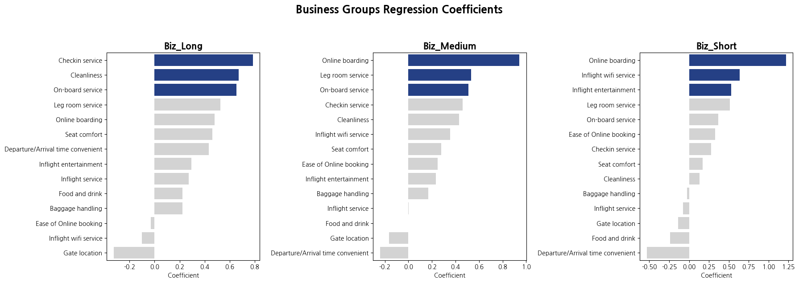

**단거리(Biz_Short)와 중거리(Biz_Medium)** 에서는 여전히 **'온라인 탑승 수속(Online boarding)'** 이 부동의 1위(계수 0.9~1.2)임. 

상관관계에서 단거리에 `Leg room service`가 중요하다고 나왔지만, 회귀분석에서는 영향력 top3 밖으로 밀려남. 중거리에서는 `Seat comfort`의 상관관계가 높았지만, top3 밖으로 밀려났고, `Leg room service`가 2위까지 올라감. 1위랑 압도적인 차이지만, 투자 효율을 볼 수 있음.

하지만 **장거리(Biz_Long)** 로 가면 양상이 완전히 뒤집힘. 1위였던 온라인 수속은 5위로 추락하고, **'체크인 서비스(Checkin)'** 와 '청결도(Cleanliness)', **'기내 서비스(On-board service)'** 가 Top 3를 장악함. 장거리 승객은 기계를 통한 빠른 수속보다, 사람(직원)이 제공하는 정중한 환대와 쾌적한 환경이 가장 영향력 있음을 알 수 있음.

## 결론을 내리기 전 T-test: 현실 점수 검증

회귀분석을 통해 어떤 서비스가 만족도 결정에 중요한 영향을 미치는지(확률)는 파악했지만 '수학적인 확률 말고, 실제 고객들이 느끼는 서비스의 점수 차이'를 확인할 필요가 있음. '혹시 0.1~0.2점의 미세한 차이가 우연히 발생한 것은 아닐까?' 라는 의문에 답할 수 있어야함.

이 질문에 답하기 위해, 만족한 고객과 불만족한 고객이 각 서비스에 준 점수의 평균 차이(Gap) 를 분석하는 독립표본 T-test를 수행.이때 검정의 기준이 되는 가설은 다음과 같음.
- 귀무가설($H_0$): "만족한 그룹과 불만족한 그룹의 서비스 점수 평균에는 차이가 없다. (차이는 우연이다)"
- 대립가설($H_1$): "만족한 그룹과 불만족한 그룹의 서비스 점수 평균에는 유의미한 차이가 있다."

**P-value(유의확률)** 가 0.05보다 작을 경우, 귀무가설을 **기각(Reject)** 하고 "통계적으로 유의미한 차이가 있다"고 판단.

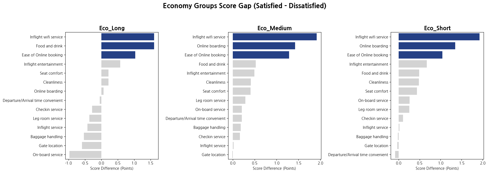

먼저  이코노미 그룹을 보면 **'기내 Wi-Fi(Inflight wifi service)'** 의 막대 길이가 매우 큰 것을 알 수 있음. 만족한 고객과 불만족한 고객의 점수 차이가 1.9점. 

반면, 중요하다고 예측했던 **'좌석(Seat comfort)'** 은 점수 차이가 불과 0.2~0.4점 수준. 이코노미 승객은 좌석이 좁아도 참을 수 있지만, 인터넷이 약한 건 절대 참지 못함.

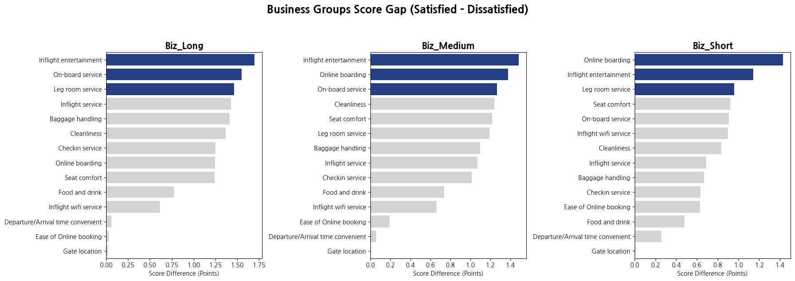

**단거리(Biz_Short)** 를 보면, **온라인 탑승 수속(Online boarding)** 의 점수 차이가 1.43점으로 가장 큼.

**장거리(Biz_Long)** 는 다름. '온라인 탑승 수속(Online boarding)'보다 **기내 서비스(On-board service)** 가 더 큼. 이건 회귀와 같은 결과임

하지만 회귀와 달리 모든 거리에서 **다리 공간(Leg room)도 1.2~1.4점대로 차이가 큼**. 하지만 여기서 알 수 있는 점은, 시트의 편안함보다 다리 공간이 더 중요하다는 점임. 

이 모든 T-test 결과의 **P-value는 0.000(Zero)** 에 수렴. 즉, 이 점수 차이는 통계적으로 매우 유의미하며 우연이 아님.

## 서비스 투자 제안

좌석은 이코노미에서는 중요하지 않다. 이코노미에서는 와이파이 인프라에 투자하면 된다.

비즈니스에서는 좌석이 중요하긴 하다. 하지만 보다 중요한 것은 온라인 체크인으로 빠른 수속이 가능하게 할 것. 그리고 기내 엔터테이먼트 최신화. 기내 서비스, 승무원 친절도가 더 중요함.

즉, 하드웨어 투자보다 위 **소프트웨어(wifi, 서비스, 프로세스 등)에 투자하는 것이 효율적**임. 만약 좌석 투자도 하고 싶다면, 시트를 갈아 엎는것보다 좌석 사이의 다리 공간을 높이는 것으로대 대체가 가능함.

하지만 만족도가 서비스로만 정해지지 않음. 운영 부분에서 지연에 의해 만족도가 크게 갈라질 것임.

## 출발 지연 vs 도착 지연